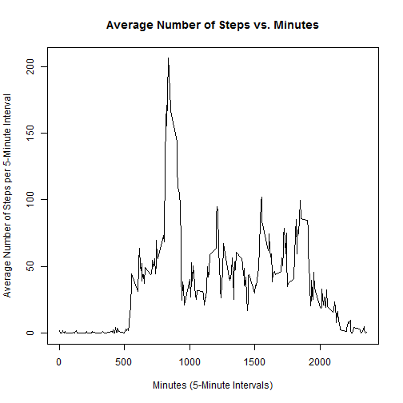

Reproducible Research Peer Assessment 1
========================================================

### Loading and preprocessing the data

1. The given data is first loaded into R.
2. The dates are then converted into the date type for R.

```r
data <- read.csv("activity.csv", header=TRUE)
date_conv <- as.Date(data$date)
```


### What is mean total number of steps taken per day?

1) Total number of steps taken per day

```r
tapply(data$steps, format(date_conv, '%Y-%m-%d'), sum)
```

```
## 2012-10-01 2012-10-02 2012-10-03 2012-10-04 2012-10-05 2012-10-06 
##         NA        126      11352      12116      13294      15420 
## 2012-10-07 2012-10-08 2012-10-09 2012-10-10 2012-10-11 2012-10-12 
##      11015         NA      12811       9900      10304      17382 
## 2012-10-13 2012-10-14 2012-10-15 2012-10-16 2012-10-17 2012-10-18 
##      12426      15098      10139      15084      13452      10056 
## 2012-10-19 2012-10-20 2012-10-21 2012-10-22 2012-10-23 2012-10-24 
##      11829      10395       8821      13460       8918       8355 
## 2012-10-25 2012-10-26 2012-10-27 2012-10-28 2012-10-29 2012-10-30 
##       2492       6778      10119      11458       5018       9819 
## 2012-10-31 2012-11-01 2012-11-02 2012-11-03 2012-11-04 2012-11-05 
##      15414         NA      10600      10571         NA      10439 
## 2012-11-06 2012-11-07 2012-11-08 2012-11-09 2012-11-10 2012-11-11 
##       8334      12883       3219         NA         NA      12608 
## 2012-11-12 2012-11-13 2012-11-14 2012-11-15 2012-11-16 2012-11-17 
##      10765       7336         NA         41       5441      14339 
## 2012-11-18 2012-11-19 2012-11-20 2012-11-21 2012-11-22 2012-11-23 
##      15110       8841       4472      12787      20427      21194 
## 2012-11-24 2012-11-25 2012-11-26 2012-11-27 2012-11-28 2012-11-29 
##      14478      11834      11162      13646      10183       7047 
## 2012-11-30 
##         NA
```
Note that for the missing values, they are set to zero as a default value.

2) Histogram of the total number of steps taken per day

```r
total_steps <- tapply(data$steps, format(date_conv, '%Y-%m-%d'), sum)
hist(total_steps, ylim=c(0,30), main="Histogram of Total Number of Steps Taken per Day", xlab="Total Number of Steps per Day")
```

 

3) Mean and median total number of steps taken per day

```r
mean(total_steps, na.rm=TRUE)
```

```
## [1] 10766.19
```

```r
median(total_steps, na.rm=TRUE)
```

```
## [1] 10765
```


### What is the average daily activity pattern?

1) Time series plot of average number of steps taken vs. 5-minute intervals

```r
interval_steps <- tapply(data$steps, data$interval, mean, na.rm=TRUE)
plot(unique(data$interval), interval_steps, type="l", main="Average Number of Steps vs. Minutes", xlab="Minutes (5-Minute Intervals)", ylab="Average Number of Steps per 5-Minute Interval")
```

 

2) Maximum number of steps for 5-minute interval

```r
which.max(interval_steps)
```

```
## 835 
## 104
```
The **835** 5-minute interval contains the maximum average number of steps.


### Imputing missing values

1) Total number of missing values

```r
sum(is.na(data$steps))
```

```
## [1] 2304
```

2) Replace each missing value with the mean number of steps for a 5-minute interval; otherwise, the original values of the number of steps remain the same

```r
for (i in 1:length(data$steps)) {
    if (is.na(data$steps[i])==TRUE) {
        data$steps[i]=mean(interval_steps)
    }
}
```

3) Dataset changed after replacing all missing values

```r
total_mod_steps <- tapply(data$steps, format(date_conv, '%Y-%m-%d'), sum, na.rm=TRUE)
```

4) Modified histogram of the total number of steps taken per day and mean/median total number of steps taken per day after replacing missing values

```r
hist(total_mod_steps, ylim=c(0,40), main="Modified Histogram of Total Number of Steps Taken per Day", xlab="Total Number of Steps per Day")
```

 

```r
mean(total_mod_steps)
```

```
## [1] 10766.19
```

```r
median(total_mod_steps)
```

```
## [1] 10766.19
```

```r
total_mod_steps
```

```
## 2012-10-01 2012-10-02 2012-10-03 2012-10-04 2012-10-05 2012-10-06 
##   10766.19     126.00   11352.00   12116.00   13294.00   15420.00 
## 2012-10-07 2012-10-08 2012-10-09 2012-10-10 2012-10-11 2012-10-12 
##   11015.00   10766.19   12811.00    9900.00   10304.00   17382.00 
## 2012-10-13 2012-10-14 2012-10-15 2012-10-16 2012-10-17 2012-10-18 
##   12426.00   15098.00   10139.00   15084.00   13452.00   10056.00 
## 2012-10-19 2012-10-20 2012-10-21 2012-10-22 2012-10-23 2012-10-24 
##   11829.00   10395.00    8821.00   13460.00    8918.00    8355.00 
## 2012-10-25 2012-10-26 2012-10-27 2012-10-28 2012-10-29 2012-10-30 
##    2492.00    6778.00   10119.00   11458.00    5018.00    9819.00 
## 2012-10-31 2012-11-01 2012-11-02 2012-11-03 2012-11-04 2012-11-05 
##   15414.00   10766.19   10600.00   10571.00   10766.19   10439.00 
## 2012-11-06 2012-11-07 2012-11-08 2012-11-09 2012-11-10 2012-11-11 
##    8334.00   12883.00    3219.00   10766.19   10766.19   12608.00 
## 2012-11-12 2012-11-13 2012-11-14 2012-11-15 2012-11-16 2012-11-17 
##   10765.00    7336.00   10766.19      41.00    5441.00   14339.00 
## 2012-11-18 2012-11-19 2012-11-20 2012-11-21 2012-11-22 2012-11-23 
##   15110.00    8841.00    4472.00   12787.00   20427.00   21194.00 
## 2012-11-24 2012-11-25 2012-11-26 2012-11-27 2012-11-28 2012-11-29 
##   14478.00   11834.00   11162.00   13646.00   10183.00    7047.00 
## 2012-11-30 
##   10766.19
```
Based on the results, the mean remains the same.  This is because I replaced the missing values with the mean number of steps for a 5-minute interval.  Also, missing values occur on an entire day, not parts of the day.  If the mean number of steps for a 5-minute interval is summed over all 5-minute intervals, it is exactly the same as the mean total number of steps.  Hence, the mean value is not affected.  Meanwhile, the median is slightly changed.  8 of the total number of steps taken per day is now the mean.  Since the mean value is the mode for the total number of steps taken per day and the mean value is very close to the median value, it makes sense for the new median value to be equal to the mean value.  If missing data exist in the dataset to get the estimate the total daily number of steps, the distribution of the histogram is affected.  If we compare the two histograms, the histogram after replacing the missing values has a taller peak in the middle distribution-wise.


### Are there differences in activity patterns between weekdays and weekends?

1) After getting the days of the week for each given date, replacing the names of the days of the week with factor label weekday or weekend

```r
library(lattice)
wds <- weekdays(date_conv)
for (i in 1:length(wds)) {
    if (wds[i]=="Saturday" | wds[i]=="Sunday") {
        wds[i] = "weekend"
    }
    else {
        wds[i] = "weekday"
    }
}
```

2) Panel plot of average number of steps taken vs. 5-minute intervals for weekdays and weekends

```r
xyplot(interval_steps~unique(data$interval) | unique(factor(wds)), type="l", main="Average Number of Steps vs. Minutes for Weekdays and Weekends", xlab="Minutes (5-Minute Intervals)", ylab="Average Number of Steps per 5-Minute Interval")
```

 


